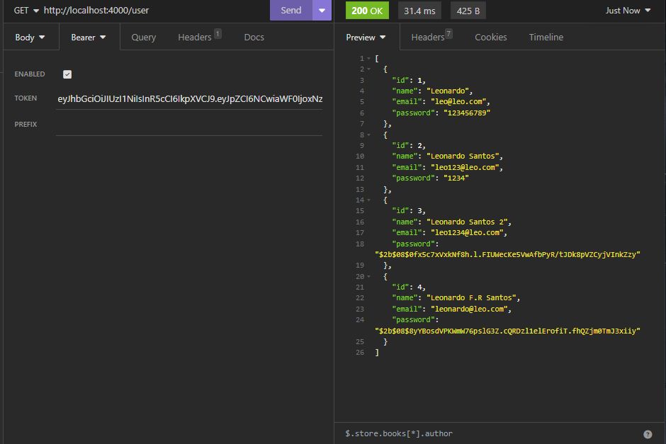

<h1 align='center'>
    
    <p>Agora ficou simples implementar autenticação e autorização</p>
</h1>

## 📕 Sobre

**auth-autorizathion** foi desenvolvido com o objetivo de melhorar o meu pensar em como efetuar um fluxo de autenticação e autorização utilizando o **TypeScript**, e ser um repositorio onde eu e outras pessoas possam consultar ao querer realizar a lógica desse fluxo e por algum motivo falhou a memoria em algum passo da aplicação. Ele contém criptação de senha, autenticação com JWT e autorização com o token fornecido durante a autenticação.

## 🛠️ Recursos Utilizados para desenvolver a aplicação Back-end

- TypeScript;
- Node;
- Express;
- Bcrypt;
- JWT - Json Web Token;
- Prisma;
- Nodemon;

## Banco de dados

- MySQL-lite

## 👨🏾‍💻 Como rodar o projeto na sua máquina

```bash
# Com a sua chave SSH ativada, selecione a pasta onde você quer colocar esse projeto, abra o terminal nela e depois copie e cole o seguinte comando no seu terminal:

$ git clone git@github.com:leofrs/auth-authorization.git
```

Após ter feito o clone, instale as dependências necessárias para rodar o projeto. Com a pasta do projeto aberta no terminal, execute os seguintes comandos um por vêz

```bash
# Se você utiliza npm, abra a pasta client no terminal e em outro terminal abra a pasta server e insira o seguinte comendo em cada terminal
$ npm i
```

```bash
# Se você utiliza yarn, abra a pasta client no terminal e em outro terminal abra a pasta server e insira o seguinte comendo em cada terminal
$ yarn i
```

obs: o script para rodar o projeto é o "server" (consulte o package.json para mais dúvidas)

## 🧾 Licença

Este Projeto utiliza a lincença MIT.
